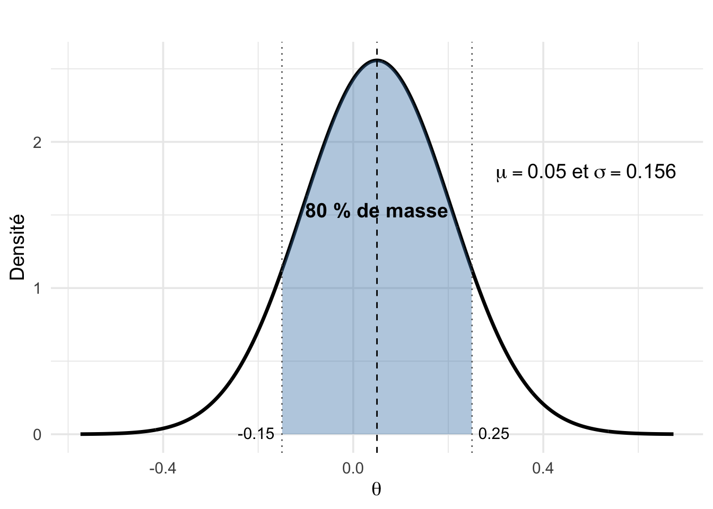

# Les distributions a priori {#prior}

## Introduction

Dans ce chapitre, nous allons explorer un aspect fondamental de la statistique bayésienne : le rôle des distributions a priori ou priors. Nous verrons comment ces priors interagissent avec les données via le théorème de Bayes pour produire la distribution a posteriori, et comment cette influence varie selon la quantité d’information apportée par les données. Nous apprendrons également à intégrer des informations extérieures pertinentes issues d’expertises ou d’études antérieures, et à évaluer de manière critique nos choix a priori à l’aide de simulations.

## Le rôle du prior {#roleprior}

En statistique bayésienne, le prior joue un rôle essentiel : il traduit nos connaissances, nos incertitudes ou, au contraire, notre absence d’information sur les paramètres d’un modèle. Bien choisir ses priors est donc une étape clé de toute analyse bayésienne. Pourquoi utiliser un prior ?

- Pour intégrer les connaissances existantes : on dispose souvent d’informations issues d’études antérieures, de méta-analyses ou d’avis d’experts. Le prior permet de formaliser et d’intégrer cette connaissance préalable, plutôt que de l’ignorer et de faire comme si on ne partait de rien. Nous verrons un exemple dans la Section \@ref(informativeprior). 

- Pour faire face à un manque de données : lorsque les données sont rares ou peu informatives, les méthodes fréquentistes peuvent échouer à estimer correctement certains paramètres (estimation aux bornes pour une probabilité, ou variance nulle). Dans ces situations, un prior bien choisi peut aider à stabiliser l’inférence, en apportant une information complémentaire.

- Pour encadrer les modèles complexes : dans les modèles mixtes, ou en présence de paramètres difficilement estimables, les priors permettent de borner l’espace des solutions à des valeurs plausibles et d’éviter des estimations aberrantes. Par exemple, dans un modèle mixte (voir Chapitre \@ref(glms)) où l'on estime la variance entre groupes ou modalités d’un effet, l'absence de prior peut entraîner des valeurs irréalistes ou des instabilités numériques. Un prior faiblement informatif peut aider dans cette situation.

- Pour prévenir le sur-ajustement : dans les modèles comportant de nombreuses variables explicatives, les priors jouent un rôle de régularisation en pénalisant les effets peu importants. Par exemple, dans une régression incluant de nombreuses covariables, un prior du type $N(0,1.5^2)$ empêche le modèle d'attribuer des effets trop forts à des variables peu informatives, réduisant ainsi le risque de sur-ajustement.

<!-- - Laisser les données dominer quand elles sont nombreuses : à l’inverse, lorsqu’on dispose d’un grand nombre d’observations, le prior a peu d’effet : la vraisemblance devient prédominante dans le calcul de la distribution a posteiori. Dans ces cas, le choix du prior devient moins critique. -->

Le choix d’un prior dépend directement du contexte et de la question scientifique.

- Un prior non-informatif vise à exprimer un manque de connaissance : il est souvent utilisé lorsqu’on ne veut pas introduire d’hypothèses fortes. En pratique, cela se traduit par des distributions larges ou uniformes. Mais attention : même un prior apparemment vague peut être informatif une fois transformé sur l’échelle du modèle, comme on le verra dans la Section \@ref(surprise). 

- Un prior informatif reflète une connaissance crédible et externe au jeu de données analysé : il peut provenir d’une synthèse bibliographique, d’une expérience passée ou de l’avis d’un spécialiste. Il a pour avantage de réduire l’incertitude sur les paramètres, surtout avec peu de données. On verra un exemple dans la Section \@ref(informativeprior). 

- Un prior faiblement informatif (ou weakly informative) est un peu un compromis entre les priors non-informatifs et informatifs. L'idée est d’exclure des valeurs manifestement aberrantes ou incompatibles avec ce que l’on sait du phénomène étudié, tout en laissant suffisamment de liberté au modèle pour apprendre des données. Ce type de prior est utilisé notamment dans `brms`. On verra un exemple dans le Chapitre \@ref(glms) qui suit. 

En pratique, une stratégie prudente consiste à commencer avec un prior faiblement informatif, comme une loi normale centrée avec une variance modérée, puis à tester des alternatives plus informatives (ou plus vagues) pour examiner l'impact sur les résultats a posteriori. C'est l'idée de l'analyse de sensibilité qu'on développe dans la Section \@ref(sensibilite). 

## Sensibilité au prior {#sensibilite}

Revenons à notre exemple fil rouge sur la survie des ragondins. Examinons comment différents choix de priors influencent la distribution a posteriori de cette probabilité de survie. Dans la Figure \@ref(fig:priors-comparaison), on a trois priors de plus en plus informatifs (en colonnes), et deux tailles d'échantillon (en lignes).

<div class="figure" style="text-align: center">

<p class="caption">(\#fig:priors-comparaison)Effet combiné du prior et de la taille d’échantillon sur la distribution a posteriori avec une vraisemblance binomiale. En colonnes : trois lois bêta a priori Beta(1,1), Beta(5,5) et Beta(20,1). En lignes : petit (n = 6, y = 2) et grand (n = 57, y = 19) échantillon (facteur 10). Le trait rouge représente le prior, le trait noir la distribution a posteriori.</p>
</div>

Avec peu de données (ligne du haut), l’effet du prior est visible : la distribution a posteriori de la survie reste proche du prior, en particulier avec la $\text{Beta}(20,1)$ qui tire l'estimation vers des valeurs élevées. Avec plus de données (ligne du bas), la distribution a posteriori est dominée par la vraisemblance : elle se concentre autour de la proportion observée, à part pour le prior $\text{Beta}(20,1)$ avec lequel la distribution a posteriori est centrée sur 0.5. On observe ainsi un principe fondamental de l'inférence bayésienne : plus les données sont nombreuses et informatives, moins le prior influence les résultats.

<!-- Prior Beta(2, 2) : ici, on suppose une connaissance initiale centrée sur 0.5, avec plus de poids au centre qu’aux extrêmes. Cette légère conviction pousse la postérieure un peu vers le centre, mais l’impact reste limité. Encore une fois, les données ont suffisamment de poids pour atténuer l'effet du prior. -->

<!-- Prior Beta(20, 1) : ce prior très informatif traduit une forte conviction préalable que la survie est élevée (mode ≈ 0.95). Cette croyance contredit les données (qui suggèrent une survie ≈ 0.33), mais la postérieure est néanmoins tirée vers le haut (≈ 0.44). C’est un cas typique où un prior dominateur impose sa structure, même face à un échantillon non négligeable. -->


<!-- D'abord une $\text{Beta}(0.5,0.5)$. Ce prior est faiblement informatif ; il accorde un léger poids supplémentaire aux valeurs proches de 0 et 1, mais reste relativement non-informatif. Le prior est large, la vraisemblance domine. L’a posteriori est très proche de $\text{Beta}(20,39)$ obtenu avec un prior uniforme. L’influence du prior est donc minime. -->

<!-- Ensuite considérons un prior modérément informatif $\text{Beta}(2,2)$. Ici, on suppose une connaissance initiale centrée sur 0.5, avec plus de poids au centre qu’aux extrêmes. Le prior contracte légèrement l’a posteriori vers 0.5, mais la différence reste faible grâce à la taille de l’échantillon. -->

<!-- Passons à un prior fortement informatif $\text{Beta}(20,1)$. Ce prior reflète une forte conviction préalable que la survie est élevée (mode ≈ 0.95). Malgré des données suggérant une survie ≈ 0.33, le prior tire fortement l’a posteriori vers le haut (≈ 0.44). C’est un exemple classique où un prior très informatif domine les données, surtout quand celles‑ci restent relativement limitées. -->

On peut formaliser les observations faites à la Figure \@ref(fig:priors-comparaison). Rappelez-vous que lorsque la vraisemblance est $\text{Bin}(n,\theta)$ avec $y$ succès, et que le prior est une loi $\text{Beta}(a,b)$, la loi a posteriori est également bêta (conjugaison), et plus exactement $\text{Beta}(a+y,\;b+n-y)$. Or la moyenne d'une $\text{Beta}(a,b)$ est $\displaystyle \frac{a}{a+b}$, et donc la moyenne de la distribution a posteriori $\text{Beta}(a+y,\;b+n-y)$ est $\displaystyle \frac{a+y}{a+b+n}$ qui peut se réécrire comme une moyenne pondérée entre la moyenne de la distribution a priori $\mu_{prior} = \displaystyle \frac{a}{a+b}$ et la proportion observée $y/n$ qui n'est autre que l’estimateur du maximum de vraisemblance $\hat{\theta}$, avec le poids $w = \displaystyle \frac{n}{a+b+n}$. Attention, c’est un poids au sens statistique du terme, un facteur de pondération, pas au sens "kilos de ragondin". Autrement dit la moyenne de la distribution a posteriori vaut $(1-w)\mu_{prior} + w \hat{\theta}$. Ainsi, quand l’échantillon de taille $n$ est grand, $w$ tend vers 1, et la moyenne a posteriori se rapproche de l’estimateur du maximum de vraisemblance. À l’inverse, pour un petit échantillon ou un prior très informatif (la somme $a+b$ est grande, voir Figure \@ref(fig:beta-exemples)), $w$ est petit, et le prior tire l’estimation. En résumé, quand les données sont limitées, on s'appuie davantage sur le prior ; quand elles sont riches, on laisse parler la vraisemblance.

En conclusion, c'est toujours une bonne idée de faire ce genre d'analyse de sensibilité. En comparant les résultats obtenus avec différents priors (non-informatif, peu informatif, informatif), on peut s'assurer que les conclusions ne dépendent pas excessivement des choix a priori. Si c'est le cas, pas de panique, ça veut simplement dire qu'on a peu d'informations sur le paramètre en question, et qu'il faut redoubler de prudence et bien réfléchir au prior utilisé. On y reviendra dans la suite. 

<!-- Même chose pour la variance : la variance a posteriori est plus faible qu’en MLE seul, car on intègre une information externe (le prior), ce qui stabilise l’estimation — surtout en petit échantillon. -->


<!-- ```{r priors-comparaison, echo=FALSE, fig.cap = "Comparaison de l'effet de trois priors Beta sur la postérieure d'une probabilité de survie. Le trait noir représente le prior, le trait rouge la distribution a posteriori. Vraisemblance is a Bin(19,57). ", out.width = "100%"} -->

<!-- library(ggplot2) -->
<!-- library(patchwork) -->

<!-- x <- seq(0, 1, length.out = 200) -->

<!-- # Fonction pour créer un panneau avec prior et posterior affichés -->
<!-- make_plot <- function(a, b, y, n) { -->
<!--   post_a <- a + y -->
<!--   post_b <- b + n - y -->

<!--   titre <- sprintf("Prior Beta(%g, %g)\nPosterior Beta(%g, %g)", a, b, post_a, post_b) -->

<!--   df <- data.frame( -->
<!--     theta = rep(x, 2), -->
<!--     density = c(dbeta(x, post_a, post_b), dbeta(x, a, b)), -->
<!--     dist = rep(c("Posterior", "Prior"), each = length(x)) -->
<!--   ) -->

<!--   ggplot(df, aes(x = theta, y = density, colour = dist)) + -->
<!--     geom_line(size = 1.2) + -->
<!--     scale_colour_manual(values = c("Posterior" = "red", "Prior" = "black")) + -->
<!--     labs(x = expression(theta), y = "Densité", title = titre, colour = NULL) + -->
<!--     theme_minimal(base_size = 14) + -->
<!--     theme(legend.position = "top", -->
<!--           plot.title = element_text(size = 13, hjust = 0.5, lineheight = 1.1)) -->
<!-- } -->

<!-- # Créer les 3 panneaux -->
<!-- p1 <- make_plot(0.5, 0.5, y = 19, n = 57) -->
<!-- p2 <- make_plot(2, 2, y = 19, n = 57) -->
<!-- p3 <- make_plot(20, 1, y = 19, n = 57) -->

<!-- # Assembler -->
<!-- (p1 | p2 | p3) + plot_layout(guides = "collect") & theme(legend.position = "top") -->
<!-- ``` -->

## Comment intégrer l'information a priori ? {#informativeprior}

### Méta-analyse

Repartons de notre exemple fil rouge sur l’estimation d’une probabilité de survie, mais en le complexifiant légèrement pour tenir compte d’un problème fréquent lorsqu'on étudie des populations animales : la détection imparfaite des individus. En effet, selon leur comportement ou les conditions de terrain, un animal peut très bien être vivant et présent, mais ne pas être détecté au moment de l’échantillonnage. Pour corriger ce biais, on utilise souvent des protocoles de capture–recapture, qui reposent sur l’identification individuelle des animaux, grâce à une bague, un motif de pelage, un profil génétique, etc.

Un individu peut ainsi être détecté (1) ou pas (0), et on code par exemple 101 qui signifie : vu la première année, manqué la seconde, puis revu la troisième. Dans le modèle le plus simple, on suppose une probabilité de survie \(\theta\) constante et une probabilité de détection \(p\) constante. La vraisemblance pour l'historique 101 est donc : $\Pr(101)=\theta\,(1-p)\,\theta\,p$. Pour obtenir la vraisemblance complète, on fait ce calcul pour chaque individu et on suppose que tous partagent les mêmes \(\theta\) et \(p\), et qu'ils sont indépendants.

Pour changer des ragondins, intéressons-nous au Cincle plongeur (*Cinclus cinclus*) un oiseau étudié pendant plus de 40 ans par Gilbert Marzolin, un professeur de mathématiques passionné d’ornithologie avec qui j'ai eu la chance de travailler. Nous disposons ici de données de capture-recapture sur 7 ans (1981–1987) pour plus de 200 oiseaux. 

On va démarrer par un prior non-informatif sur la probabilité de survie, au hasard une $\text{Beta}(1,1)$. Ce sera notre modèle A. Comme prior alternatif, on peut s’appuyer sur des connaissances accumulées pour des espèces similaires. Chez les passereaux, on observe par exemple une relation entre la masse corporelle et la probabilité de survie : en moyenne, les oiseaux plus lourds vivent plus longtemps. Cette relation dite allométrique a été quantifiée par @mccarthy2007 grâce à une régression linéaire (voir Chapitre \@ref(lms)), à partir des données de survie et de masse pour 27 espèces de passereaux européens. En utilisant cette régression sur les passereaux au cas particulier du cincle, et sachant que le cincle pèse en moyenne 59.8 grammes, on peut prédire sa probabilité de survie annuelle. Le modèle fournit ainsi une estimation de 0.57 avec une erreur standard de 0.075. Ces valeurs nous permettent de définir un prior informatif, sous la forme d’une loi normale centrée en 0.57 et de variance $0.075^2$. Ce sera notre modèle B.

On obtient ainsi les résultats suivants pour le cincle : 

| Modèle | Prior pour \(\theta\) | Survie moy. a posteriori | Intervalle crédibilité 95% |
|-----|---------|--------------|--------------|
| A     | Beta(1,1)  | 0.56                      | [0.51 ; 0.61] |
| B     | N(0.57, 0.075²)| 0.56                      | [0.52 ; 0.61] |

Avec un jeu de données riche (7 années), l’information contenue dans la vraisemblance domine ; le prior informatif n’apporte presque aucune information, et les deux modèles produisent des résultats très proches. 

Imaginons maintenant qu'on a des données limitées. Que se passe‑t‑il si l’on ne dispose que des trois premières années par exemple ? On refait l'analyse, et les résultats sont maintenant : 

| Modèle | Prior pour \(\theta\) | Survie moy. a posteriori | Intervalle crédibilité 95% |
|-----|---------|--------------|--------------|
| A  | Beta(1,1) | 0.70 | [0.47 ; 0.95] |
| B  | N(0.57, 0.075²) | 0.60 | [0.48 ; 0.72] |

Cette fois, le prior informatif fait une vraie différence. On réduit la largeur de l’intervalle de près de 50%, tout en ramenant l’estimation moyenne vers une valeur plus réaliste pour un passereau. On note aussi que l’estimation postérieure du modèle B avec 3 années de données est proche de celle obtenue avec 7 années (Figure \@ref(fig:comparaison-prior-survie)). 

<div class="figure" style="text-align: center">

<p class="caption">(\#fig:comparaison-prior-survie)Comparaison des estimations a posteriori de la survie du cincle plongeur selon le type de prior et la durée de l’étude. Chaque point représente la moyenne a posteriori, avec son intervalle de crédibilité à 95%. La ligne grise indique la valeur de survie issue de la méta-analyse pour les passereaux (0.57).</p>
</div>

Cet exemple montre que les données issues de la littérature (ici une relation allométrique masse–survie obtenue via une méta-analyse) peuvent être utilisées pour construire un prior informatif pertinent, capable d’améliorer sensiblement la précision des estimations, en particulier lorsque les données sont limitées. Cette approche offre une alternative peu coûteuse à l'allongement des protocoles de terrain.


### Méthode du moment-matching

Dans l'exemple du cincle, on a utilisé une distribution normale comme prior informatif pour un paramètre qui se trouve être une probabilité. Or la normale peut prendre des valeurs négatives ou plus grande que 1, ce qui n'est pas souhaitable pour une probabilité. Dans l'exemple, le prior informatif $N(0.57, 0.075^2)$ est en moyenne entre 0 et 1 avec une petite variance, donc peu de chance que cela tourne mal. Vous pouvez vous en rendre compte en simulant des données avec `R` et la commande `summary(rnorm(n = 100, mean = 0.57, sd = 0.075))`. Malgré tout, ça n'est pas très satisfaisant. 

La bonne nouvelle c'est qu'on peut construire un prior informatif plus adéquat pour une probabilité par la méthode dit du "moment-matching". La méthode du moment-matching sert à choisir les paramètres d’une loi a priori en les calant sur les moments (souvent la moyenne et la variance) qui traduisent l’information a priori qu’on possède (avant de voir les données).  

Lorsque l'information a priori est disponible sous forme d’une moyenne \(\mu\) et d’un écart‑type \(\sigma\), on peut transformer ces moments en paramètres \(a,b\) d’une distribution bêta. Pour rappel, la moyenne et la variance d'une bêta de paramètres $a$ et $b$ sont \(\mu=\dfrac{a}{a+b}\) et \(\sigma^2=\dfrac{ab}{(a+b)^2(a+b+1)}\). En inversant ces relations on obtient : \(a=\displaystyle \Bigl(\frac{1-\mu}{\sigma^2}-\frac{1}{\mu}\Bigr)\mu^2\) et \(b=\displaystyle a\Bigl(\frac{1}{\mu}-1\Bigr)\). Dans notre exemple, on a $\mu=0.57$ et $\sigma=0.075$ dont on peut déduire $a = 24.3$ et $b = 18.3$ avec quelques lignes de code : 

``` r
# paramètres de moyenne et d'écart-type souhaités pour la distribution bêta
mu <- 0.57 # moyenne de la probabilité
sigma <- 0.075 # écart-type sur cette probabilité
# formules inverses pour obtenir les paramètres a et b d'une distribution bêta
a <- ((1 - mu) / (sigma^2) - 1 / mu) * mu^2
b <- a * (1 / mu - 1)
# affichage des valeurs de a et b arrondies
c(a = round(a, 1), b = round(b, 1))
#>    a    b 
#> 24.3 18.3
```

On peut vérifier que cette distribution bêta a bien pour moyenne et écart-type les valeurs données par la méta-analyse : 

``` r
# on génère 10000 valeurs tirées d'une loi Bêta avec les paramètres a = 24.3 et b = 18.3
ech_prior <- rbeta(n = 10000, shape1 = 24.3, shape2 = 18.3)
# on calcule la moyenne empirique des tirages (doit approcher 0.57)
mean(ech_prior)
#> [1] 0.570328
# on calcule l'écart-type empirique des tirages (doit approcher 0.075)
sd(ech_prior)
#> [1] 0.07613299
```

On peut donc adopter un prior \(\text{Beta}(a=24.3,\,b=18.3)\) pour tenir compte de l'information moyenne et sa variabilité obtenue par la relation allométrique survie-masse. 

La méthode du moment matching ne s'applique pas qu'aux probabilités. On peut aussi s'en servir pour construire un prior pour un paramètre réel, par exemple l'effet de la masse des ragondins sur leur survie (voir Chapitre \@ref(lms)). Imaginons qu’un·e expert·e dise : « Je suis 80% sûr que le paramètre $\theta$ se trouve entre –0.15 et 0.25. ». Cette phrase définit un intervalle de crédibilité à 80 % : $\Pr(\theta \in [-0.15,0.25]) = 0.80$. On cherche un prior de type loi normale $\theta \sim N(\mu,\sigma^2)$ qui reflète exactement cette information. 

On peut commencer par la moyenne $\mu$. L'intervalle est symétrique, donc on peut déduire directement que la moyenne $\mu$ du prior est le milieu de l'intervalle : $\displaystyle{\mu = \frac{-0.15+0.25}{2}}=0.05$.

Passons à l'écart-type $\sigma$. L'expert·e affime que 80% des valeurs de $\theta$ sont comprises entre –0.15 et 0.25. Or pour une loi normale, cette proportion s'écrit $\Pr(\mu - z\,\sigma \leq \theta \leq \mu + z \, \sigma) = 0.80$. Cela signifie que 80% de la masse de la distribution est contenue dans un intervalle centré sur $\mu$ et de largeur $2z\sigma$. Pour un niveau de 80%, la valeur de $z$ vaut environ 1.2816 (on l'obtient via `qnorm(0.90)` où 0.90 est le quantile supérieur $1−\alpha/2 = 1-20/2$ avec $(1−\alpha)\% = 80\%$ et donc $\alpha = 0.20$). Finalement, on obtient $\sigma = \displaystyle \frac{0.25-(-0.15)}{2 \times 1.2816} \approx 0.156$. Voici le calcul dans `R` : 

``` r
# borne inférieure et supérieure données par l’expert·e
a <- -0.15
b <-  0.25

# niveau de confiance exprimé
level <- 0.80
alpha <- 1 - level

# valeur z correspondant à un intervalle de crédibilité à 80 %
z <- qnorm(1 - alpha / 2)  # ≈ 1.2816

# moyenne = centre de l’intervalle
mu <- (a + b) / 2

# écart-type déduit de la largeur de l’intervalle
sigma <- (b - a) / (2 * z)

mu
#> [1] 0.05
sigma
#> [1] 0.1560608
```

On conclut que le prior informatif voulu est une $N(\mu=0.05,\sigma=0.156)$. On peut vérifier que tout s'est bien passé :

``` r
mu    <- 0.05
sigma <- 0.1560608
pnorm(c(-0.15, 0.25), mean = mu, sd = sigma)
#> [1] 0.09999996 0.90000004
#> 0.10 0.90    # Ok : 10 % à gauche, 90 % à droite → 80 % au centre
```

Visuellement, la Figure \@ref(fig:prior-normal-viz) représente la densité d'une loi normale avec une moyenne $\mu=0.05$ et un écart-type $\sigma=0.156$. L'intervalle en bleu clair correspond à l'intervalle crédible central à 80%, c’est-à-dire l'intervalle [−0.15; 0.25] qui contient 80% de la masse de probabilité. Les lignes pointillées grises indiquent les bornes de cet intervalle, tandis que la ligne en pointillés noirs marque la position de la moyenne. On observe que, grâce à la symétrie de la loi normale, l’intervalle est centré autour de la moyenne, et que 10% de la masse est située de chaque côté en dehors de cet intervalle.

<div class="figure" style="text-align: center">

<p class="caption">(\#fig:prior-normal-viz)Distribution normale avec une moyenne de 0.05 et un écart-type de 0.156. L’intervalle ombré correspond à l’intervalle de crédibilité à 80 %, entre –0.15 et 0.25.</p>
</div>

## Attention aux priors dits non-informatifs {#surprise}

En statistique bayésienne, on utilise souvent des priors non-informatifs. Mais attention, les apparences peuvent être trompeuses, surtout lorsqu'on travaille sur des paramètres définis sur des échelles transformées, comme le logit ou le log dans les modèles linéaires généralisés (Chapitre \@ref(glms)). Prenons un exemple courant où l’on modélise une probabilité $\theta$ sur l’échelle logit via un paramètre $\beta$ tel que $\text{logit}(\theta) = \beta$. 

En pratique, on peut utiliser les simulations pour vérifier que des priors ne réservent pas de mauvaises surprises après transformation, c'est ce qu'on appelle des prior predictive checks. Ça se passe avant même d’ajuster un modèle, et pour ce faire on va :

1. simuler des valeurs depuis le prior de $\beta$ sur l’échelle logit ;
2. appliquer la transformation réciproque du logit pour obtenir $\theta$ ;
3. inspecter la distribution a priori induite sur $\theta$ et juger si elle semble réaliste.

Un premier choix est de prendre comme prior une loi normale avec une grande variance, par exemple $\beta \sim N(0, 10^2)$. Les étapes 1 et 2 s'obtiennent via :

``` r
logit_prior <- rnorm(n = 1000, mean = 0, sd = 10) # simulation
prior <- plogis(logit_prior) # transformation
```

Le problème est qu'après transformation avec la fonction réciproque du logit, la majorité des valeurs simulées, et donc la probabilité $\theta$, sont proches de 0 ou de 1 comme on le voit dans la Figure \@ref(fig:prior-combined-ggplot) (panneau de gauche), ce qui favorise de manière implicite des valeurs extrêmes. On passe d'un prior non-informatif sur l'échelle logit à un prior très informatif (sans le vouloir) sur l'échelle naturelle de la probabilité. 

Un autre choix consiste à prendre $\beta \sim N(0, 1.5^2)$. Les deux premières étapes de la simulation se résument à :

``` r
logit_prior2 <- rnorm(n = 1000, mean = 0, sd = 1.5)
prior2 <- plogis(logit_prior2)
```

Ici la distribution induite sur $\theta$ est uniforme, couvrant surtout la plage de valeurs entre 0.05 et 0.95 comme on peut le voir dans la Figure \@ref(fig:prior-combined-ggplot) (panneau de droite), ce qui reflète mieux un manque d'information sur $\theta$. Ce deuxième choix est le bon, on parle de priors faiblement informatifs (ou weakly informative). 

<div class="figure" style="text-align: center">

<p class="caption">(\#fig:prior-combined-ggplot)Comparaison de deux priors obtenus sur la probabilité \( \theta = \text{logit}^{-1}(\beta) \) après transformation par la fonction logit réciproque de \( \beta \sim N(0, 10^2) \) et \( \beta \sim N(0, 1.5^2) \).</p>
</div>

Il existe aussi des priors invariants, c’est-à-dire dont la forme tient compte de l’échelle du paramètre. Le prior de Jeffreys en est un exemple : il maximise l’information apportée par les données, tout en restant invariant par reparamétrisation. Par exemple, pour une probabilité \(\theta\), le prior de Jeffreys est $\text{Beta}(0.5, 0.5)$. Ce prior est moins plat qu'une uniforme $\text{Beta}(1, 1)$. Il est souvent utilisé lorsqu’on souhaite une approche objective, sans introduire d’information subjective. En pratique toutefois, le prior de Jeffreys est difficile à calculer, et on privilégiera l'approche par simulations pour s'assurer que les paramètres transformés ont des priors raisonnables. 

## En résumé

+ Plus les données sont riches, moins le prior influence l’estimation a posteriori.  

+ N'hésitez pas à prendre le temps de visualiser vos priors sur l'échelle naturelle des paramètres à l'aide de simulations.

+ Les méthodes de moment-matching offrent un moyen pratique de transformer, d'encoder des connaissances dans les paramètres de distributions qui peuvent servir de priors (bêta ou normale par exemple).

+ Quand utiliser quel type de prior ?

| Type de prior               | Usage recommandé                                                           | Avantages                                                              | Précautions                                                            |
|----------------------------|----------------------------------------------------------------------------|------------------------------------------------------------------------|------------------------------------------------------------------------|
| Informé                | Quand on dispose d’informations solides (expertise, méta-analyse, etc.)   | Intègre les connaissances disponibles, utile avec peu de données      | Risque de biais si mal calibré                |
| Faiblement informatif  | Par défaut si l’on souhaite guider l’inférence sans la contraindre        | Protège contre des valeurs aberrantes, améliore la stabilité numérique | Doit être adapté à l’échelle du paramètre                            |
| Non-informatif         | Cas exploratoires, ou pour laisser parler les données                   | Ne privilégie a priori aucune valeur particulière                      | Peut être trompeur sur des échelles transformées (logit, log)  |
| De référence / Jeffreys| Quand on recherche une approche invariante (une $\text{Beta}(0.5,0.5)$ dans l'exemple fil rouge)                 | Invariant par changement de paramétrisation                            | Parfois difficile à calculer ou à interpréter                        |


