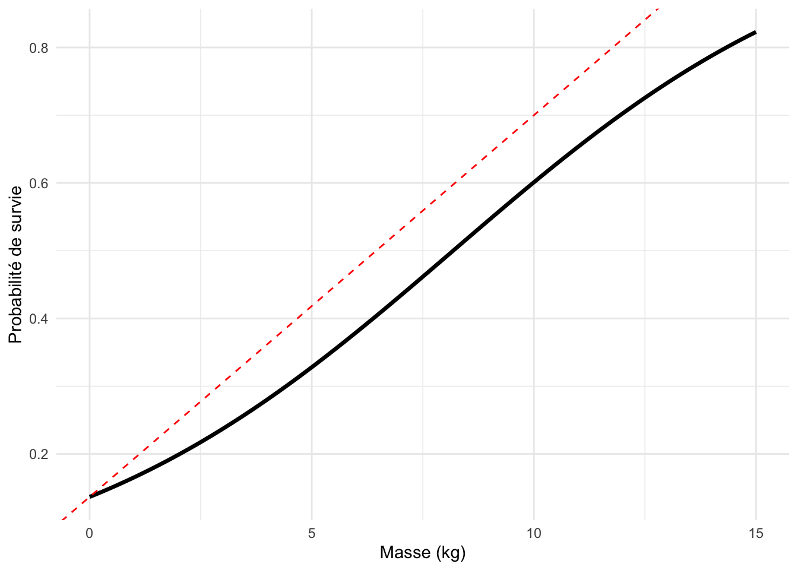
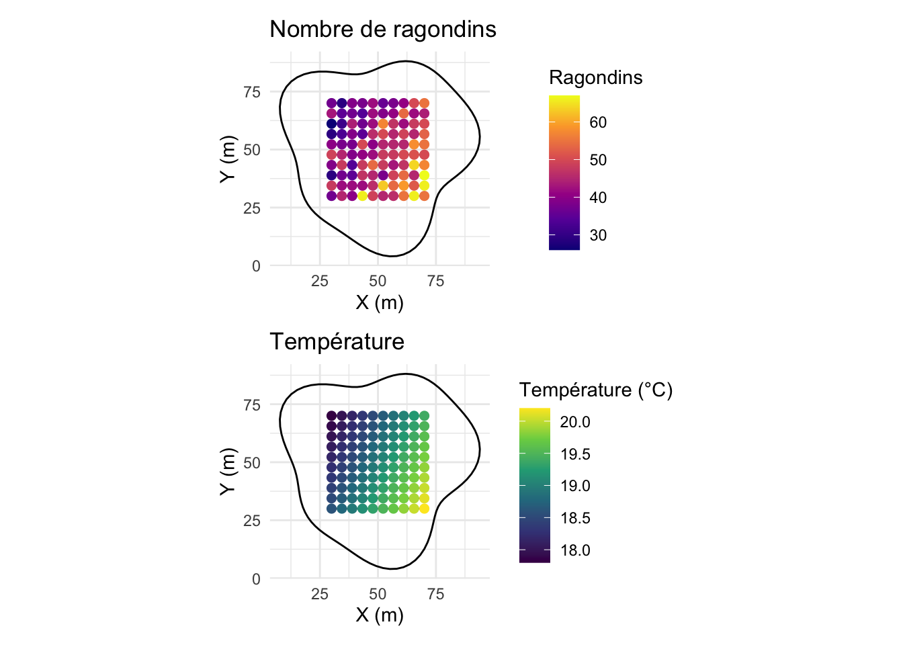
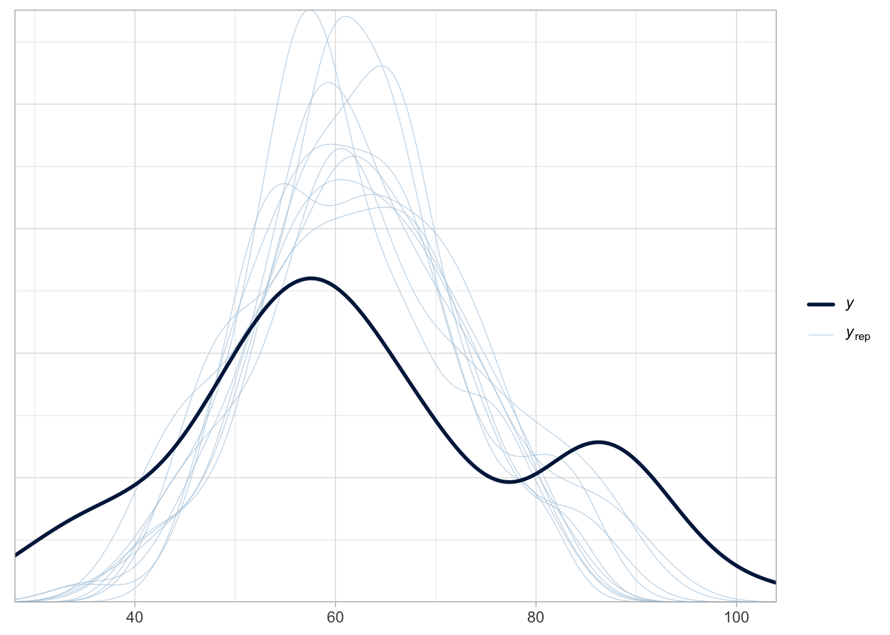
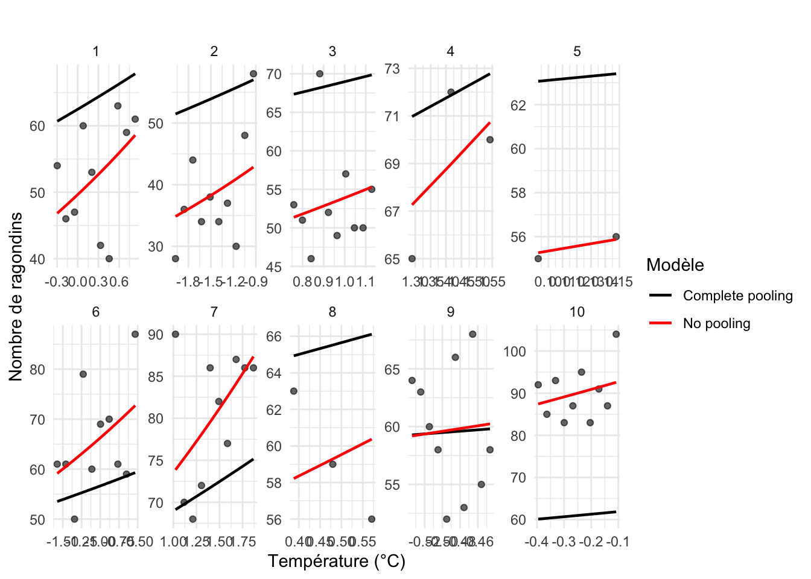
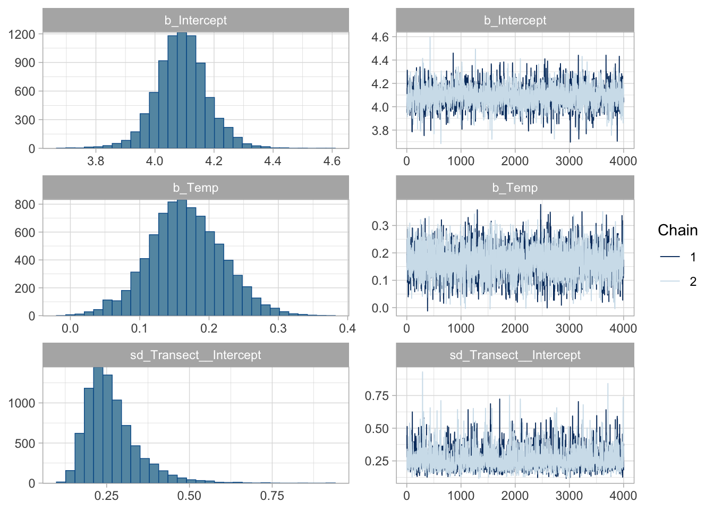
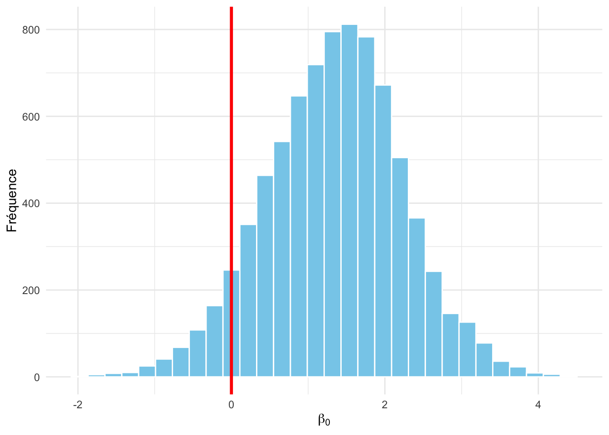

# Modèles linéaires généralisés, et généralisés mixtes {#glms}

## Introduction 

Ce chapitre présente l’application de la statistique bayésienne à des extensions du modèle linéaire vu au chapitre précédent, les modèles linéaires généralisés (GLM) et les modèles linéaires généralisés mixtes (GLMM). On commencera par un GLM qui nous permettra de revisiter notre exemple fil rouge sur la survie des ragondins et les données binaires. Nous utiliserons ensuite un GLMM pour analyser des données de comptage. Nous utiliserons `brms` et comparerons avec l'approche fréquentiste (pour `NIMBLE`, rendez-vous en ligne à <https://oliviergimenez.github.io/statistique-bayes/index.html>).

## Modèles linéaires généralisés (GLM)

Dans le Chapitre \@ref(lms), on a introduit la régression linéaire $y_i \sim N(\mu_i,\sigma^2)$ avec $\mu_i = \beta_0 + \beta_1 x_i$ où on modélise la moyenne $\mu$ de la variable réponse $y$ en fonction d'une variable explicative $x$. Ce modèle dit linéaire est bien adapté à une variable réponse continue. Mais que se passe-t-il lorsque la variable réponse est discrète ? Revenons à notre exemple sur le ragondin dans lequel on étudie le nombre d'animaux qui survivent. Si l'on applique la régression linéaire sur ces données, on va obtenir un nombre décimal de ragondins, ce qui est un peu embêtant pour un effectif par définition discret. De plus, si l'on introduit une variable explicative $x_i$ comme la masse pour expliquer les variations dans le nombre de ragondins qui survivent, on peut se retrouver avec une probabilité de survie négative, ou plus grande que un. Pourquoi ? Et bien car rien n'oblige le modèle linéaire à ne considérer que des valeurs positives et plus petites que un. 

On a vu au Chapitre \@ref(principes) la solution. On note $z_i = 1$ quand le ragondin $i$ a survécu, et $z_i = 0$ sinon, et on suppose que l'événement de survie est comme une expérience de pile ou face avec une probabilité $\theta$, autrement dit chaque $z_i$ suit une Bernoulli de paramètre $\theta$. Si l'on suppose que les individus sont indépendants et on la même distribution, alors le nombre total de ragondins qui survivent à l'hiver $\displaystyle\sum_{i=1}^n{z_i} = y$ suit une binomiale $y \sim \text{Bin}(n, \theta)$ avec $\theta$ la probabilité de survie.

On a aussi vu aux Chapitres \@ref(mcmc) et \@ref(logiciels) qu'on pouvait utiliser la fonction logit pour forcer un paramètre à être bien estimé entre 0 et 1. Il s'agit d'écrire que $\text{logit}(\theta_i) = \beta_0 + \beta_1 x_i$, comme expliqué dans la Figure \@ref(fig:logit-link).

<div class="figure" style="text-align: center">

<p class="caption">(\#fig:logit-link)À gauche : la fonction logit transforme une probabilité p en une valeur continue non bornée logit(p) qui vit entre moins l'infini et plus l'infini. À droite : la fonction logit inverse transforme une combinaison linéaire de prédicteurs (valeur linéaire sur la figure) en probabilité qui vit entre 0 et 1. La fonction logit est utilisée dans la régression logistique (GLM avec distribution binomiale) pour transformer une probabilité (entre 0 et 1) en une variable continue définie sur l'ensemble des réels. Puis, la fonction logit inverse permet ensuite de revenir à l’échelle des probabilités.</p>
</div>


Pour formaliser un peu, on a : 
\begin{align}
z_i &\sim \text{Bernoulli}(\theta_i) &\text{[vraisemblance]}\\
\text{logit}(\theta_i) &= \beta_0 + \beta_1 \; x_i &\text{[relation linéaire]}\\
\theta_i &= \text{logit}^{-1}(\beta_0 + \beta_1 \; x_i) = \dfrac {e^{\beta_0 + \beta_1 \; x_i}} {1+e^{\beta_0 + \beta_1 \; x_i}} &\text{[relation transformée]}\\
  \beta_0, \beta_1 &\sim \text{Normale}(0, 1.5) &\text{[prior sur les paramètres]} \\
\end{align}

<!-- C'est équivalent à :  -->
<!-- \begin{align}  -->
<!-- \text{Réponse } &\sim \text{Distribution(Moyenne de la réponse)} \\ -->
<!-- y &\sim \text{Binomiale}(n, \theta_i) \\ -->
<!-- \text{logit}(\theta_i) &= a + b \; x_i\\ -->
<!-- \theta_i &= \text{logit}^{-1}(a + b \; x_i) = \dfrac {e^{a+b \; x_i}} {1+e^{a+b \; x_i}} \\ -->
<!-- \end{align} -->

Pour illustrer tout ça, on peut reprendre les données ragondins auxquelles on ajoute des données de masse des individus, et pour ce faire, on recrée les données brutes, c'est-à-dire les $z_i$ :

``` r
# Nombre total de ragondins suivis, survivants
n <- 57
y <- 19

# Créer les données individuelles (0 = mort, 1 = vivant)
z <- c(rep(1, y), rep(0, n - y))

# Ajouter une covariable continue (ex : masse)
set.seed(123)
masse <- rnorm(n, mean = 5, sd = 1)  # masse simulée en kg

df_bern <- data.frame(survie = z, masse = masse)
```

On peut maintenant ajuster les deux modèles avec `brms` par exemple (on obtiendrait la même chose avec `NIMBLE`), la régression linéaire et la régression logistique : 


``` r
# Ajustement de la régression linéaire
fit_lm <- brm(survie ~ masse, 
              data = df_bern, 
              family = gaussian())

# Ajustement de la régression logistique
fit_logit <- brm(survie ~ masse, 
                 data = df_bern, 
                 family = bernoulli())
```

Au passage, l'interprétation des coefficients de la régression logistique n'est pas facile. On introduit souvent la notion de rapport des chances pour y aider, mais personnellement, ça ne me parle pas plus que ça. Je reviens toujours à une représentation graphique de la relation entre la probabilité de succès (la survie ici) et les variables explicatives (la masse ici), comme dans la Figure \@ref(fig:logit-vs-gaussian). On observe ici une tendance positive, mais elle est due uniquement au hasard de la simulation (puisque les données ont été générées sans effet de la masse). Une autre façon intuitive de s'en sortir est d'utiliser la règle du 4 proposée par Andrew Gelman et ses collègues. L'astuce consiste à diviser la pente de la régression logistique par 4. Cela donne une estimation approximative du changement de probabilité attendu pour une variation d'une unité de la variable explicative, au point où la courbe est la plus pentue. Si la pente est estimée à 0.23 par exemple, alors la pente maximale de la courbe logistique (autour du point d’inflexion, là où elle change de forme) est approximativement de 0.23/4 = 0.06. Cela signifie qu'une augmentation d’une unité de la variable explicative (ici, la masse du ragondin augmente de 1kg) augmente la probabilité de survie d'environ 6% au point où la pente est la plus forte (on passe d'une probabilité de survie de 0.5 à 0.53), comme illustré dans la Figure \@ref(fig:gelman-rule) :


<div class="figure" style="text-align: center">

<p class="caption">(\#fig:gelman-rule)Illustration de la règle du 4 de Gelman. Ici, on approxime l’effet de la masse du ragondin sur la probabilité de survie (la courbe logistique en noir) autour du point d’inflexion par une droite dont la pente est donnée par le coefficient estimé divisé par 4 (la droite en tirets rouge).</p>
</div>

Mais je m'égare, revenons au problème de la régression linéaire appliquée à des données binaires. Comme on peut le voir dans la Figure \@ref(fig:logit-vs-gaussian), la régression linéaire consiste à faire passer une droite sans borne dans les données binaires, ce qui peut conduire à des survies plus grandes que 1 (et/ou plus petites que 0 même si ça n'est pas le cas ici). La régression logistique, en revanche, contraint naturellement les prédictions entre 0 et 1 grâce à la transformation logit, ce qui en fait un choix adapté aux variables de type succès/échec. Au passage, j'ai utilisé la formulation Bernoulli pour introduire une variable explicative mesurée à l'échelle de l'individu, mais si ça n'est pas nécessaire, on peut repasser à la formulation groupée avec la binomiale comme dans les chapitres précédents.

<div class="figure" style="text-align: center">

<p class="caption">(\#fig:logit-vs-gaussian)Comparaison entre une régression linéaire et une régression logistique ajustées sur des données binaires. La régression linéaire (en bleu) produit des prédictions plus grandes que 1 (embêtant pour une probabilité de survie), tandis que la régression logistique (en rouge) garantit une estimation de probabilité valide.</p>
</div>

## Modèles linéaires généralisés mixtes (GLMM)

### Introduction

Souvent, les données sont récoltées ou mesurées avec une certaine structure, elles sont hiérarchisées ou groupées, par exemple la relation entre la survie de ragondins et leur masse dans différentes populations de différents bassins versants. Il est alors pertinent de modéliser cette structure dans les données. Cela permet de mieux expliquer la variabilité dans la survie moyenne qui n'est pas expliquée par la masse, et donc d'obtenir de meilleures estimations. Pour ce faire, on introduit les modèles linéaires généralisés mixtes (GLMM) qui combinent des effets fixes comme dans les GLM, représentant l’effet moyen d’une variable explicative (la masse dans l'exemple des ragondins), et des effets aléatoires représentant la variabilité entre groupes ou niveaux hiérarchiques. 

Qu'est-ce qu'un effet aléatoire ? Un effet est aléatoire lorsqu'il représente une sélection aléatoire d’unités dans une population plus vaste, par exemple des sites d’échantillonnage ou des individus ; si l'on devait refaire l'expérience, peu importe les sites ou les individus, l'important est de pouvoir généraliser l'interprétation des effets. En ce sens, le sexe des ragondins par exemple ne peut pas être considéré comme un effet aléatoire ; si on refait l'expérience, la variable sexe a toujours les deux mêmes modalités mâle et femelle. Ou encore, considérer les sites d'une aire d'étude de nos ragondins comme un effet fixe permet seulement de dire des choses sur ces sites précis, sans possibilité de généraliser à la « population » de sites, ou l'aire d'étude. 

Au passage, vous verrez utiliser les termes modèles hiérarchiques, multi-niveaux ou à effets aléatoires pour GLMM. Parfois il s'agit de la même chose, parfois il s'agit de GLMM un peu modifiés. Pour éviter les confusions, souvenez-vous que les GLMM sont utilisés pour analyser des données qui viennent avec une structure en groupes.  

### Exemple

Pour illustrer concrètement un GLMM, imaginez la situation où l'on cherche à estimer l'abondance de ragondins dans le bassin versant du Lez, à Montpellier, où le Lez est un fleuve qui traverse la ville. On répartit dix transects sur la zone d'étude. Sur chaque transect, on compte le nombre de ragondins présents à 10 points espacés régulièrement. On s'intéresse à la réponse du nombre de ragondins (comptages) en fonction de la température. Les mesures sont bien hiérarchisées, on fait 1 mesure du nombre de ragondins sur chacun des 10 points que contient chacun des 10 transects. Le protocole est illustré dans la Figure \@ref(fig:protocole) et s'inspire du livre de mon collègue Jason Matthiopoulos [@matthiopoulosHowBeQuantitative2011].

<div class="figure" style="text-align: center">

<p class="caption">(\#fig:protocole)Schéma des données sur les ragondins selon un protocole d’échantillonnage avec 10 points dans 10 transects. L'aire d'étude est en noir. En haut on a le nombre de ragondins, et en bas la température.</p>
</div>


A partir de ce protocole, simulons des données avec le script suivant. On va corser le tout en supposant que sur nos 10 transects, on a eu des soucis d'échantillonnage sur 3 d'entre eux pour lesquels on n'a pu faire que 2 ou 3 points : 

``` r
set.seed(123) # pour la reproductibilité
transects <- 10 # nombre total de transects
nb_points <- c(10, 10, 10, 3, 2, 10, 10, 3, 10, 10) # nombre de points par transect
data <- NULL # objet qui stockera les données simulées
for (tr in 1:transects){
  ref <- rnorm(1, 0, .3) # effet aléatoire du transect (N(0,0.3²))
  # température simulée le long du transect :
  # point de départ aléatoire entre 18 et 22 °C puis légère pente par segment
  t <- runif(1, 18, 22) + runif(1, -0.2, 0.2) * 1:10
  # intensité attendue (échelle log) : relation linéaire avec la température
  ans <- exp(ref + 0.2 * t)
  # comptage Poisson de ragondins pour chaque point
  an <- rpois(nb_points[tr], ans)
  # empile les 10 points du transect courant
  data <- rbind(data, cbind(rep(tr, nb_points[tr]), t[1:nb_points[tr]], an))
}
# on met tout dans un data.frame
sim_simple <- data.frame(
  Transect    = data[, 1],
  Temperature = data[, 2],
  Ragondins    = data[, 3]
)
head(sim_simple)
#>   Transect Temperature Ragondins
#> 1        1    19.78911        54
#> 2        1    19.94232        46
#> 3        1    20.09553        47
#> 4        1    20.24874        60
#> 5        1    20.40194        53
#> 6        1    20.55515        42
```

J'ai commenté le code, ce qui devrait en faciliter la lecture. Malgré tout, quelques explications sur les différentes étapes s'imposent. On commence par une boucle `for (tr in 1:transects)` qui simule les données pour chacun des dix transects, un par un. À chaque fois, on tire un effet aléatoire spécifique (`ref`), qui va faire varier un peu l’intercept de la relation entre température et nombre de ragondins selon le transect. Ensuite, on génère une séquence de températures (`t`) avec un point de départ tiré au hasard, et une petite pente qui change légèrement la température d'un point à l’autre. À partir de cette température, on calcule l’intensité attendue du processus de comptage (`ans`) en supposant une relation linéaire (sur l'échelle log), puis on génère les données observées (`an`) en tirant des valeurs dans une loi de Poisson de moyenne `ans`. Enfin, on regroupe tout dans un tableau (`sim_simple`) pour pouvoir ensuite analyser tout ça. Voici la Figure \@ref(fig:plotsimple) qui illustre les données qu'on obtient : 
<div class="figure" style="text-align: center">

<p class="caption">(\#fig:plotsimple)Relation entre le nombre de ragondins et la température par transect, avec plusieurs points de comptage (10 pour tous, sauf les transects 4, 5 et 8 pour lesquels on a 3, 2 et 3 points) par transect.</p>
</div>

### L'approche GLM

On souhaite analyser ces données. On n'a pas à faire à des données binaires ici comme dans le début de ce chapitre, mais des données de comptage. Pour modéliser ce type de données, on utilise une distribution de Poisson avec une fonction de lien logarithmique $\log(\theta_i) = \beta_0 + \beta_1 \text{temp}_{i}$ où $\text{temp}_{i}$ est la température :

\begin{align}
   \text{y}_i &\sim \text{Poisson(}\theta_i) &\text{[vraisemblance]}\\
  \text{log}(\theta_i) &= \beta_{0} + \beta_1 \; \text{temp}_{i} &\text{[relation linéaire]} \\
  \text{}\theta_i &= e^{\beta_0 + \beta_1 \; \text{temp}_{i}} &\text{[relation transformée]} \\
  \beta_0, \beta_1 &\sim \text{Normale}(0, 1.5) &\text{[prior sur les paramètres]} \\
\end{align}

Cette distribution est relativement facile à manipuler, puisqu'entre autres, elle a un seul paramètre $\theta$ qui donne le taux d'apparition de l'événement modélisé, et qu'en moyenne, le nombre attendu de ragondins ici devrait être égal à ce paramètre. 

Dans ce GLM avec distribution de Poisson, les coefficients $\beta_0$ et $\beta_1$ s’interprètent sur l’échelle logarithmique. Plus précisément, une variation d’une unité de température entraîne une multiplication du nombre moyen de ragondins par $\exp(\beta_1)$. Par exemple, si $\beta_1 = 0.3$, alors une augmentation d’un degré correspond à une hausse attendue d’environ $35\%$ du nombre moyen de ragondins, puisque $\exp(0.3) \approx 1.35$. On peut aussi visualiser graphiquement la relation entre le nombre de ragondins et la température, comme dans les Figures \@ref(fig:pooling-ragondins) et \@ref(fig:partial-ragondins) à venir.

Dans un premier modèle, oublions la structure en groupes/niveaux dans les données, ici les transects. On fait passer une seule droite dans le nuage de points, c'est le modèle avec "complete pooling" ou regroupement complet : 


``` r
# on n'oublie pas de standardiser la covariable température
sim_simple$Temp <- scale(sim_simple$Temperature)

# modèle avec complete pooling 
fit_complete <- brm(Ragondins ~ Temp,
                    data = sim_simple, # données simulées
                    family = poisson("log")) # distribution de Poisson, lien log
```

Les résultats sont les suivants : 

``` r
summary(fit_complete)
#>  Family: poisson 
#>   Links: mu = log 
#> Formula: Ragondins ~ Temp 
#>    Data: sim_simple (Number of observations: 78) 
#>   Draws: 2 chains, each with iter = 5000; warmup = 1000; thin = 1;
#>          total post-warmup draws = 8000
#> 
#> Regression Coefficients:
#>           Estimate Est.Error l-95% CI u-95% CI Rhat Bulk_ESS Tail_ESS
#> Intercept     4.13      0.01     4.11     4.16 1.00     5374     5177
#> Temp          0.10      0.01     0.07     0.13 1.00     5936     5368
#> 
#> Draws were sampled using sampling(NUTS). For each parameter, Bulk_ESS
#> and Tail_ESS are effective sample size measures, and Rhat is the potential
#> scale reduction factor on split chains (at convergence, Rhat = 1).
```

Ici on ignore que les données sont mesurées par transect, et on suppose à tort que toutes les observations sont indépendantes. Le risque, c’est de tirer de mauvaises conclusions : on peut croire qu’une seule relation existe, alors que les différences ne sont pas dues à la température, mais aux variations d’un transect à l’autre, ou au contraire on peut passer à côté d’une vraie tendance. Un test d'ajustement permet de voir dans la Figure \@ref(fig:ppcheck-complete) que l'ajustement n'est pas bon : 
<div class="figure" style="text-align: center">

<p class="caption">(\#fig:ppcheck-complete)Vérification de l'adéquation du modèle avec complete pooling ou regroupement complet. Les distributions simulées (en bleu) sont comparées aux données observées (en noir). Le mauvais recouvrement indique une mauvaise adéquation du modèle aux données.</p>
</div>

Pour prendre en compte la structuration des données, on peut ajuster un autre modèle dans lequel le transect est traité comme un effet fixe. Autrement dit, on ajuste une droite séparée pour chaque transect, avec son propre intercept, mais la même pente : 


``` r
# modèle avec no pooling / pas de regroupement (effet fixe transect)
fit_nopool <- brm(Ragondins ~ Temp + as.factor(Transect),
                    data = sim_simple, # données simulées
                    family = poisson("log")) # distribution de Poisson, lien log
```

Les résultats sont les suivants :

``` r
summary(fit_nopool)
#>  Family: poisson 
#>   Links: mu = log 
#> Formula: Ragondins ~ Temp + as.factor(Transect) 
#>    Data: sim_simple (Number of observations: 78) 
#>   Draws: 2 chains, each with iter = 5000; warmup = 1000; thin = 1;
#>          total post-warmup draws = 8000
#> 
#> Regression Coefficients:
#>                     Estimate Est.Error l-95% CI u-95% CI Rhat Bulk_ESS Tail_ESS
#> Intercept               3.90      0.05     3.81     3.99 1.00     3659     4650
#> Temp                    0.20      0.06     0.08     0.32 1.00     2684     3611
#> as.factorTransect2      0.04      0.12    -0.21     0.28 1.00     3001     3973
#> as.factorTransect3     -0.12      0.07    -0.26     0.03 1.00     4207     5527
#> as.factorTransect4      0.05      0.11    -0.16     0.26 1.00     3737     4859
#> as.factorTransect5      0.09      0.10    -0.12     0.29 1.00     5687     5484
#> as.factorTransect6      0.49      0.10     0.29     0.68 1.00     3009     4224
#> as.factorTransect7      0.19      0.09     0.02     0.37 1.00     3322     4124
#> as.factorTransect8      0.08      0.09    -0.09     0.26 1.00     5512     5480
#> as.factorTransect9      0.28      0.08     0.13     0.43 1.00     3452     4601
#> as.factorTransect10     0.64      0.06     0.53     0.77 1.00     3729     4715
#> 
#> Draws were sampled using sampling(NUTS). For each parameter, Bulk_ESS
#> and Tail_ESS are effective sample size measures, and Rhat is the potential
#> scale reduction factor on split chains (at convergence, Rhat = 1).
```

Ici j'ai indiqué à `brms` de considérer le transect comme une variable catégorielle, un facteur, c'est le `as.factor(Transect)` dans l'appel à la fonction `brm()`. Par défaut, le premier niveau du facteur (ici le transect 1) est utilisé comme niveau de référence. Cela signifie que l’intercept $\beta_0$ estimé dans le modèle correspond au transect 1, et que les coefficients associés aux autres transects représentent les écarts (sur l'échelle log) par rapport à ce transect 1. Par exemple, on estime $\beta_0$ à 3.9039221, c'est l'intercept pour le transect 1. On estime aussi le décalage entre le transect 1 et le transect 2 à 0.0372134. Alors l'intercept pour le transect 2 est donné par 3.9411355. Ce calcul peut être répété pour chaque transect pour obtenir les intercepts spécifiques, que l’on peut ensuite transformer via l'exponentielle pour retrouver le nombre moyen attendu de ragondins (sur l'échelle d'origine) pour une température moyenne (qui vaut 0 ici puisqu'on a standardisé la variable température) :

``` r
# extraire l'intercept (référence = Transect 1)
beta0 <- fixef(fit_nopool)["Intercept", "Estimate"]

# tous les coefficients du modèle
coefs <- fixef(fit_nopool)

# effets associés aux autres transects
coefs_transects <- coefs[grep("as.factor", rownames(coefs)), "Estimate"]

# calcul des intercepts par transect
intercepts_log <- c(
  Transect1 = beta0,
  beta0 + coefs_transects
)

# calcul des nombres moyens attendus de ragondins sur l’échelle d’origine
nombres <- exp(intercepts_log)

# le tableau qui résume
df_intercepts <- data.frame(
  Transect = names(intercepts_log),
  Intercept_log = round(intercepts_log, 2),
  Nombre = round(nombres, 2)
)

# affichage
df_intercepts
#>                                Transect Intercept_log Nombre
#> Transect1                     Transect1          3.90  49.60
#> as.factorTransect2   as.factorTransect2          3.94  51.48
#> as.factorTransect3   as.factorTransect3          3.79  44.15
#> as.factorTransect4   as.factorTransect4          3.95  51.94
#> as.factorTransect5   as.factorTransect5          3.99  54.02
#> as.factorTransect6   as.factorTransect6          4.39  80.75
#> as.factorTransect7   as.factorTransect7          4.10  60.22
#> as.factorTransect8   as.factorTransect8          3.98  53.74
#> as.factorTransect9   as.factorTransect9          4.19  65.76
#> as.factorTransect10 as.factorTransect10          4.55  94.53
```

On estime bien un intercept pour chaque transect, donc 10 intercepts, et la pente, c'est-à-dire l'effet de la température, est la même pour tous les transects. Notez aussi que les valeurs obtenues `Nombre` ici sont des moyennes attendues issues du modèle de Poisson. Ce sont donc des valeurs continues, décimales, bien que les données observées soient des comptages entiers. C'est une caractéristique des modèles de Poisson : la variable à prédire est discrète, mais le modèle s’appuie sur une moyenne continue pour modéliser sa distribution.

La qualité de l'ajustement est meilleure comme on le voit dans la Figure \@ref(fig:ppcheck-nopool) : 
<div class="figure" style="text-align: center">

<p class="caption">(\#fig:ppcheck-nopool)Vérification de l'adéquation du modèle avec no pooling ou pas de regroupement. Les distributions simulées (en bleu) sont comparées aux données observées (en noir). Le mauvais recouvrement indique une mauvaise adéquation du modèle aux données.</p>
</div>

Ce modèle "no pooling" fait mieux que le modèle "complete pooling", comme on peut le voir dans la Figure \@ref(fig:pooling-ragondins), mais il reste insatisfaisant. L'approche "no pooling" consiste à ajuster un modèle indépendant pour chaque transect, sans partager d'information entre ces groupes. Cela pose deux problèmes : d'une part, on ne peut pas généraliser les résultats obtenus à d'autres transects que ceux observés ; d'autre part, on ignore des informations potentiellement utiles en supposant que chaque transect n’a rien à apprendre des autres. Cette stratégie devient particulièrement inefficace lorsque chaque groupe comporte peu d'observations.

<div class="figure" style="text-align: center">

<p class="caption">(\#fig:pooling-ragondins)Comparaison entre les modèles complete pooling (noir) et no pooling (rouge) pour prédire le nombre de ragondins en fonction de la température, par transect. Le modèle no pooling ajuste une courbe indépendante pour chaque transect, tandis que le complete pooling suppose une relation commune.</p>
</div>

### L'approche GLMM

Revenons à notre objectif : évaluer l’effet de la température sur l’abondance des ragondins, tout en prenant en compte la structure hiérarchique des données (segments imbriqués dans des transects). Jusqu’ici, les modèles complete pooling et no pooling représentaient deux extrêmes : soit on supposait que tous les transects partageaient exactement la même relation température–abondance, soit on estimait une relation totalement indépendante pour chacun d’eux (via un intercept spécifique à chaque transect). Les modèles linéaires généralisés mixtes (GLMM), ou partial pooling, permettent un compromis plus réaliste.

On construit un GLMM dans lequel on autorise chaque transect à avoir un intercept propre - c’est-à-dire une abondance moyenne spécifique - mais on suppose que ces intercepts ne sont pas totalement indépendants. On les considère plutôt comme des variations aléatoires autour d’un intercept moyen $\beta_0$, issues d’une même distribution normale. Cela revient à dire que nos transects $\beta_{0j}$ (où $j$ varie de 1 à 10) sont tirés d’une population plus large de transects possibles, dans laquelle l’abondance moyenne varie d'un transect à l’autre. On modélise cette variabilité spatiale à l’aide d’un effet aléatoire, noté ici $\beta_{0j} \sim N(\beta_0,\sigma)$, où $\sigma$ est la variation entre transects.

Autrement dit, chaque intercept par transect $\beta_{0j}$ peut s'écrire comme une déviation $b_j$ autour de l’intercept global $\beta_{0j} = \beta_0 + b_j$ avec $b_{j} \sim N(0,\sigma)$ où $\beta_0$ représente l’intercept moyen (pour un transect "typique") et $\sigma$ quantifie la variabilité entre transects. Par exemple, si l’intercept moyen est $\beta_0 = 2$, mais que le transect 4 a un intercept de $\beta_{04} = 3$, on dira que cet effet spécifique $b_4 = 1$ correspond à une abondance plus élevée que la moyenne.

Cette modélisation hiérarchique permet de capturer l’hétérogénéité spatiale tout en partageant l'information entre groupes, ce qui est particulièrement utile lorsque certains transects comportent peu d’observations. On peut aussi voir le modèle partial pooling (3 paramètres estimés dans l'exemple ragondin : $\beta_0, \beta_1, \sigma$) comme un compromis entre le modèle complete pooling (2 paramètres estimés dans l'exemple ragondin : $\beta_0, \beta_1$) et le modèle no pooling (11 paramètres estimés dans l'exemple ragondin : 10 intercept et 1 pente $\beta_1$). 

Si on formalise un peu ça, le GLMM correspondant s'écrit : 

\begin{align}
   \text{y}_i &\sim \text{Poisson(}\theta_i) &\text{[vraisemblance]}\\
  \text{log}(\theta_i) &= \beta_{0j} + \beta_1 \; \text{temp}_{i} &\text{[relation linéaire]} \\
  \beta_{0j} &\sim \text{Normale}(\beta_0, \sigma) &\text{[effet aléatoire]} \\
  \beta_0 &\sim \text{Normale}(0, 1.5) &\text{[prior sur l'intercept moyen]} \\
  \sigma &\sim \text{Exp}(1) &\text{[prior pour l'erreur standard de l'effet aléatoire]} \\
  \beta_1 &\sim \text{Normale}(0, 1.5) &\text{[prior pour la pente]} \\
\end{align}

#### Ajustement du modèle en bayésien avec `brms`

On ajuste d'abord le GLMM avec partial pooling avec `brms` : 


``` r
# modèle avec partial pooling (effet aléatoire transect)
fit_partial <- brm(Ragondins ~ Temp + (1 | Transect), # relation nombre de ragondins vs température avec effet aléatoire transect sur l'intercept
                    data = sim_simple, # données simulées
                    family = poisson("log")) # distribution de Poisson, lien log
```

Dans la syntaxe, l'effet aléatoire sur l'intercept est spécifié avec `(1 | Transect)`, où le `1` signifie qu'on travaille sur l'intercept, et qu'il y a un intercept par (c'est le `|`) transect. Si on voulait ajouter un effet aléatoire sur la pente, on écrirait `(1 + Temp | Transect)`.   

Les résultats sont : 

``` r
summary(fit_partial)
#>  Family: poisson 
#>   Links: mu = log 
#> Formula: Ragondins ~ Temp + (1 | Transect) 
#>    Data: sim_simple (Number of observations: 78) 
#>   Draws: 2 chains, each with iter = 5000; warmup = 1000; thin = 1;
#>          total post-warmup draws = 8000
#> 
#> Multilevel Hyperparameters:
#> ~Transect (Number of levels: 10) 
#>               Estimate Est.Error l-95% CI u-95% CI Rhat Bulk_ESS Tail_ESS
#> sd(Intercept)     0.27      0.08     0.16     0.47 1.00     2119     3183
#> 
#> Regression Coefficients:
#>           Estimate Est.Error l-95% CI u-95% CI Rhat Bulk_ESS Tail_ESS
#> Intercept     4.09      0.09     3.92     4.27 1.00     2087     2747
#> Temp          0.17      0.05     0.06     0.27 1.00     3559     4119
#> 
#> Draws were sampled using sampling(NUTS). For each parameter, Bulk_ESS
#> and Tail_ESS are effective sample size measures, and Rhat is the potential
#> scale reduction factor on split chains (at convergence, Rhat = 1).
```

Ce résumé fournit les estimations a posteriori des effets fixes ainsi que des écarts-types des effets aléatoires. La ligne `sd(Intercept)` donne l'estimation de $\sigma$, proche du 0.3 utilisé pour simuler les données (l'intervalle de crédibilité contient la vraie valeur). Les lignes `Intercept` et `Temp` donnent les estimations de $\beta_0$ et $\beta_1$ sur l'échelle log. On verra un peu plus tard comment vérifier que ces estimations sont proches des valeurs utilisées pour simuler les données.

On peut aussi jeter un coup d'oeil aux densités et traces des paramètres (Figure \@ref(fig:model-diagnostics)) : 

``` r
plot(fit_partial)
```

<div class="figure" style="text-align: center">

<p class="caption">(\#fig:model-diagnostics)Vérification de la convergence des chaînes MCMC pour le modèle avec partial pooling.</p>
</div>

On peut alors mettre à jour la Figure \@ref(fig:pooling-ragondins) avec la Figure \@ref(fig:partial-ragondins) :
<div class="figure" style="text-align: center">

<p class="caption">(\#fig:partial-ragondins)Comparaison entre les modèles complete pooling (noir), no pooling (rouge) et partial pooling (bleu) pour prédire le nombre de ragondins en fonction de la température, par transect. Le modèle no pooling ajuste une courbe indépendante pour chaque transect, le complete pooling suppose une relation commune, tandis que le partial pooling fournit un compromis grâce à l'effet aléatoire transect.</p>
</div>

On voit que l'ajustement fourni par le partial pooling est très similaire au no pooling, et bien meilleur que le complete pooling. Il y a une petite différence pour les transects avec peu de points d'échantillonnage, les transects 4, 5 et 8, pour lesquels le partial pooling se rapproche du complete pooling. En l'absence de plus d'information (de données) pour ces transects, il est plutôt raisonnable que les estimations se rapprochent de la moyenne donnée par le modèle avec complete pooling plutôt que vers des valeurs extrêmes, atypiques. Rappelez-vous que dans un GLMM, les niveaux de l'effet aléatoire sont caractéristiques d'une population avec une moyenne commune. C'est ce partage d'information entre les transects avec 10 points d'échantillonnage et ceux avec 2 ou 3 points, on parle de "borrowing strength" qui permet d'atténuer, de tamponner, on parle de "shrinkage", la tendance à sur-ajuster du modèle avec no pooling ou à effet fixe, et en ce sens on parle parfois de "regularization". 

La qualité de l'ajustement est validée comme on le voit dans la Figure \@ref(fig:ppcheck-partial) : 
<div class="figure" style="text-align: center">

<p class="caption">(\#fig:ppcheck-partial)Vérification de l'adéquation du modèle avec partial pooling ou regroupement partiel. Les distributions simulées (en bleu) sont comparées aux données observées (en noir). Le mauvais recouvrement indique une mauvaise adéquation du modèle aux données.</p>
</div>

Lorsqu'on ajuste un modèle sur une variable standardisée, comme ici la température centrée-réduite, les coefficients estimés ($\beta_0, \beta_1$) s'interprètent sur cette échelle modifiée : $\beta_1$ représente l'effet d'un écart-type de température, et $\beta_0$ correspond à la valeur attendue quand la température standardisée est 0, c'est-à-dire à la température moyenne. On a souvent envie d'exprimer les effets sur des unités compréhensibles, ici les degrés celsius, plutôt qu'en écart-type de température, qui est plus abstrait. Pour revenir à une interprétation sur l'échelle réelle (en degré celsius donc), les coefficients estimés sur la température centrée-réduite peuvent être transformés pour revenir à l'échelle réelle à l'aide des formules suivantes :

$$
\beta_1^{\text{réel}} = \frac{\beta_1^{\text{standardisé}}}{\text{écart-type de la température}}
$$

$$
\beta_0^{\text{réel}} = \beta_0^{\text{standardisé}} - \beta_1^{\text{standardisé}} \times \frac{\text{moyenne de la température}}{\text{écart-type de la température}}
$$

Dans `R`, vous pouvez utiliser le code suivant : 

``` r
# on récupère les valeurs simulées dans les distributions a posteriori des paramètres
post <- as_draws_matrix(fit_partial)
sbzero <- post[, "b_Intercept"]
sbun <- post[, "b_Temp"]

# on récupère moyenne et écart-type de la température
mu <- attr(scale(sim_simple$Temperature), "scaled:center")
sg <- attr(scale(sim_simple$Temperature), "scaled:scale")

# on convertit les coefficients standardisés
bun   <- sbun / sg # beta1 réel
bzero <- sbzero - sbun * mu / sg # beta0 réel
```

On peut alors visualiser les coefficients sur l’échelle originale et comparer à la valeur utilisée pour simuler les données comme dans les Figures \@ref(fig:hist-b0-reel) et \@ref(fig:hist-b1-reel) : 

``` r
tibble(b0 = bzero) %>%
  ggplot(aes(x = b0)) +
  geom_histogram(color = "white", fill = "skyblue", bins = 30) +
  geom_vline(xintercept = 0, color = "red", linewidth = 1.2) +
  labs(
    x = expression(beta[0]),
    y = "Fréquence"
  ) +
  theme_minimal()
```

<div class="figure" style="text-align: center">

<p class="caption">(\#fig:hist-b0-reel)Distribution a posteriori de l'intercept moyen (échelle réelle). La ligne rouge indique la vraie valeur (0).</p>
</div>


``` r
tibble(b1 = bun) %>%
  ggplot(aes(x = b1)) +
  geom_histogram(color = "white", fill = "skyblue", bins = 30) +
  geom_vline(xintercept = 0.2, color = "red", linewidth = 1.2) +
  labs(
    x = expression(beta[1]),
    y = "Fréquence"
  ) +
  theme_minimal()
```

<div class="figure" style="text-align: center">

<p class="caption">(\#fig:hist-b1-reel)Distribution a posteriori de l'effet de la température (échelle réelle). La ligne rouge indique la vraie valeur (0.2).</p>
</div>

On retrouve les paramètres ayant servi à simuler les données (en rouge). Il ne s'agit que d'une seule simulation, c'est donc normal qu'en moyenne on n'obtienne pas exactement la même chose (c'est-à-dire que le trait rouge ne coïncide pas plus à la plus grande valeur de l'histogramme), c'est seulement en répétant l'expérience de simulations un grand nombre de fois que cela se produirait. 

En bonus, comparons les modèles avec et sans effet de la température. Cela permet de tester la pertinence de la température comme variable explicative : 


``` r
# modèle avec partial pooling (effet aléatoire transect)
fit_partial2 <- brm(Ragondins ~ 1 + (1 | Transect), # un intercept moyen, pas d'effet de la température, avec l'effet aléatoire transect
                    data = sim_simple, # données simulées
                    family = poisson("log")) # distribution de Poisson, lien log
```

On calcule le WAIC pour chaque modèle, et on les compare : 

``` r
waic1 <- waic(fit_partial)
waic2 <- waic(fit_partial2)
tibble(
  Modèle = c("Avec température", "Sans température"),
  WAIC = c(waic1$estimates["waic", "Estimate"],
           waic2$estimates["waic", "Estimate"])
)
#> # A tibble: 2 × 2
#>   Modèle            WAIC
#>   <chr>            <dbl>
#> 1 Avec température  542.
#> 2 Sans température  551.
```

En conclusion, le modèle incluant la température offre un meilleur ajustement aux données selon le critère WAIC. Et fort heureusement puisqu'on a simulé selon ce modèle ! 


#### Ajustement du modèle en fréquentiste avec `lme4`

Pour clôre ce chapitre, je vous propose de faire la même analyse avec le package `lme4` en fréquentiste. 

On charge le dit package : 

``` r
library(lme4)
```

Puis on applique le GLMM, notez que la syntaxe de `brms` est inspirée de celle utilisée dans `lme4` : 

``` r
fit_lme4 <- glmer(
  Ragondins ~ Temp + (1 | Transect), # formule complète
  data   = sim_simple,        # jeu de données simulé précédemment
  family = poisson      # distribution adaptée à un comptage
)
```

Voici les résultats :

``` r
summary(fit_lme4)
#> Generalized linear mixed model fit by maximum likelihood (Laplace
#>   Approximation) [glmerMod]
#>  Family: poisson  ( log )
#> Formula: Ragondins ~ Temp + (1 | Transect)
#>    Data: sim_simple
#> 
#>       AIC       BIC    logLik -2*log(L)  df.resid 
#>     568.3     575.3    -281.1     562.3        75 
#> 
#> Scaled residuals: 
#>     Min      1Q  Median      3Q     Max 
#> -1.9501 -0.6223 -0.1098  0.4779  2.3897 
#> 
#> Random effects:
#>  Groups   Name        Variance Std.Dev.
#>  Transect (Intercept) 0.04402  0.2098  
#> Number of obs: 78, groups:  Transect, 10
#> 
#> Fixed effects:
#>             Estimate Std. Error z value Pr(>|z|)    
#> (Intercept)  4.08804    0.06898  59.266  < 2e-16 ***
#> Temp         0.15797    0.04863   3.248  0.00116 ** 
#> ---
#> Signif. codes:  0 '***' 0.001 '**' 0.01 '*' 0.05 '.' 0.1 ' ' 1
#> 
#> Correlation of Fixed Effects:
#>      (Intr)
#> Temp -0.106
```

Comment lire les sorties ?

| Élément | Signification |
|---------|---------------|
| `(Intercept)` | Moyenne de ragondins pour un transect moyen, à Temp moyenne (échelle log). |
| `Temp` | Effet linéaire de la température. |
| `Random effects` | Écart‑type (`Std.Dev`) de l’intercept aléatoire. |

On peut noter que les estimations des paramètres obtenus sont très proches des estimations obtenues avec `brms`. 


<!-- On peut aussi visualiser l'effet de la température à la Figure \@ref(fig:viz-lme4) : -->
<!-- ```{r viz-lme4, fig.cap="Relation entre le nombre de ragondins attendu (sur l'échelle log) et la température, avec l'intervalle de confiance en gris.", echo=TRUE} -->
<!-- visreg::visreg(fit_lme4, xvar = 'Temp') -->
<!-- ``` -->

## En résumé

+ Les modèles linéaires généralisés (GLM) permettent d’étendre les modèles linéaires aux situations où l’on ne peut pas supposer une erreur normale.

+ L'idée générale est d’utiliser une distribution adaptée à la variable réponse — Bernoulli ou binomiale pour les variables binaires (0/1), Poisson pour les comptages (0, 1, 2, etc.) - et de relier la moyenne de cette distribution aux variables explicatives par une fonction de lien (comme logit ou log).

+ L’introduction d’effets aléatoires permet de modéliser des groupes hiérarchiques dans les données (e.g., sites, individus, transects), en tenant compte de leur hétérogénéité tout en partageant l'information entre eux.

+ Les modèles linéaires généralisés mixtes (GLMM) permettent d’estimer simultanément des effets fixes (valables pour toute la population), et des effets aléatoires (propres à chaque groupe, mais supposés tirés d’une distribution commune).

+ Dans un modèle à *complete pooling*, on ignore la structure en groupes : on suppose que toutes les données suivent exactement la même relation avec les variables explicatives. Cela peut mener à des conclusions biaisées si les groupes diffèrent réellement. Dans un modèle à *no pooling*, on estime une relation distincte pour chaque groupe, sans partage d’information. Cela produit des estimations très variables, surtout si certains groupes ont des tailles d'échantillon faibles. Les modèles à *partial pooling*, ou GLMM, ou modèles hiérarchiques, représentent un compromis entre ces deux extrêmes : les groupes ont leurs propres paramètres, mais ceux-ci sont liés via une distribution commune. Cela permet d’améliorer la stabilité des estimations tout en respectant les différences entre groupes.

