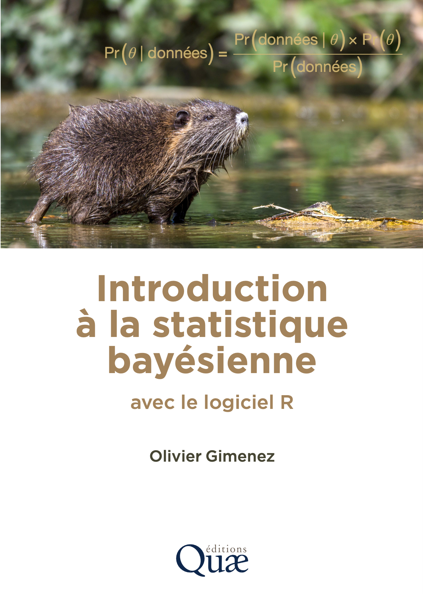

--- 
title: "Introduction à la statistique bayésienne avec R"
author: "Olivier Gimenez"
date: "`r Sys.Date()`"
knit: "bookdown::render_book"
site: bookdown::bookdown_site
output:
  bookdown::bs4_book:
    downloads:
      - name: "Télécharger le PDF"
        url: statistique-bayesienne.pdf
  bookdown::pdf_book:
    latex_engine: xelatex
    toc: true
    number_sections: true
    keep_tex: false
documentclass: book
bibliography: [book.bib]
biblio-style: apalike
link-citations: true
links-as-notes: true
colorlinks: true
#github-repo: oliviergimenez/statistique-bayes
#cover-image: images/cover.png
url: https://oliviergimenez.github.io/statistique-bayes/
description: "Introduction à la statistique bayésienne avec R"
---

```{r include=FALSE}
# configuration globale des chunks
# knitr::opts_chunk$set(dpi = 600,
#                       warning = FALSE,
#                       message = FALSE,
#                       cache = FALSE)

knitr::opts_chunk$set(
  dev       = "svglite",   # le device SVG
  fig.ext   = "svg",       # extension des fichiers
  fig.path  = "svg/",  # dossier + préfixe de sortie
  fig.width = 7,           # en pouces
  fig.height= 5,
  dpi       = 300,         # ignoré pour le vectoriel (utile si un calque est rasterisé)
  dev.args  = list(
    bg = "transparent"    # ou "white" si l’éditeur préfère
  )
)
```

# Introduction {-}

<!-- ## Avertissement {-} -->

<!-- Ce livre est en cours de rédaction. N'hésitez pas à faire une suggestion, un commentaire ou proposer une correction. Il vous suffit de [m'envoyer un email](mailto:olivier.gimenez@cefe.cnrs.fr) ou [me laisser un message](https://github.com/oliviergimenez/statistique-bayes/issues/new). Merci ! -->

<!-- 📄 Vous pouvez télécharger le version PDF [ici](./statistique-bayesienne.pdf). -->

<!-- <!-- <a href="https://www.netlify.com">  </a> -->

On retrouve la statistique bayésienne un peu partout en sciences. Par exemple, en épidémiologie, pour prédire la circulation des virus, en écologie, pour expliquer l’extinction des espèces végétales et animales, ou encore en informatique, pour filtrer les courriels nuisibles. Si l’utilisation de la statistique bayésienne a explosé au cours des dernières années, c’est grâce au progrès de nos ordinateurs. C’est aussi grâce à la nature même de l’approche qui permet de coller à notre façon d’apprendre, de raisonner et d’accumuler des connaissances.

Dans ce livre, je vous propose une introduction à la statistique bayésienne. Vous êtes en train de lire la version électronique du livre à paraître chez les éditions Quae en mars 2026.

```{r echo=FALSE, fig.align='center', out.width='100%'}

```

Ce livre est en français parce que c’est la langue dans laquelle je me sens le plus à l’aise pour écrire, et parce que j’aurais aimé avoir plus d’ouvrages dans ma langue maternelle lorsque j’étais étudiant.

Je me suis fixé comme objectifs de 1) synthétiser les aspects méthodologiques à bien comprendre, et 2) fournir les moyens pratiques pour utiliser vous-mêmes la statistique bayésienne. Parce que l’on comprend mieux en faisant, nous utiliserons un logiciel pour pratiquer la statistique. Ce logiciel, c’est `R`, c’est un logiciel libre pour faire des statistiques et de la science des données. En français, je recommande l’excellent manuel de Julien Barnier, *Introduction à R et au tidyverse* disponible en ligne via <https://juba.github.io/tidyverse> et le site du projet collaboratif *Analyse-R*, disponible aussi en ligne à <https://larmarange.github.io/analyse-R/>. Pour la statistique bayésienne en particulier, je présente un package qui propose une syntaxe simple et familière, proche de celle utilisée pour les régressions dans `R` : `brms`. Dans la version enrichie de ce livre consultable en ligne à <https://oliviergimenez.github.io/statistique-bayes/>, je présente aussi un package qui nécessite de programmer (écrire des boucles par exemple), mais qui offre en contrepartie une grande flexibilité : `NIMBLE`.

Plutôt que dans un style académique, j’ai choisi d’écrire un peu comme si nous étions ensemble dans la même pièce ou en visioconférence, et que je devais vous expliquer de vive voix la statistique bayésienne. Ainsi, je ferai parfois (souvent, en fait) des abus de langage et des approximations mathématiques pour faciliter la compréhension. Vous ne m’en voudrez pas, j’espère.

## Pourquoi s'intéresser à la statistique bayésienne ? {-}

<!-- Contrairement à l'approche fréquentiste, qui considère les paramètres comme des valeurs fixes mais inconnues, l'approche bayésienne les modélise comme des quantités aléatoires, décrites par une distribution de probabilité qui reflète nos incertitudes. -->

La statistique bayésienne est une approche pour analyser les données et prendre des décisions en présence d’incertitude, comme lorsqu’on lance un dé ou que l’on prévoit la météo : on ne peut pas savoir exactement ce qui va se passer, mais on peut estimer les chances des différents résultats. Pourquoi adopter cette approche ? Plusieurs raisons peuvent motiver son utilisation :

- une interprétation naturelle des probabilités : en statistique bayésienne, une probabilité représente un degré de confiance dans une hypothèse ou dans un paramètre, ce qui correspond bien à notre manière intuitive de raisonner face à l’incertitude ;
- une grande flexibilité : le cadre bayésien s’adapte bien à des données incomplètes, hétérogènes ou rares, ainsi qu’à des modèles complexes (hiérarchiques, non linéaires, dynamiques, etc.) ;
- la possibilité d’intégrer des connaissances préalables : on peut capitaliser sur des résultats d’études précédentes ou des avis d’expertises de manière transparente et formalisée ;
- une gestion rigoureuse de l’incertitude : la statistique bayésienne fournit non seulement une estimation des paramètres, mais aussi une mesure directe de l’incertitude associée.

## Ce que nous allons voir dans ce livre {-}

J’aimerais vous guider dans l’apprentissage de la statistique bayésienne. J’ai rassemblé le matériel qui m’a paru essentiel pour la comprendre et l’appliquer. L’objectif est que vous soyez à l’aise avec l’approche bayésienne et que vous puissiez l’appliquer à vos propres données. Les objectifs sont de :

- démythifier la statistique bayésienne et les méthodes de Monte Carlo par chaînes de Markov (MCMC) ;
- comprendre les différences entre approche bayésienne et approche fréquentiste ;
- lire et comprendre les sections "méthodes" des articles scientifiques utilisant l'approche bayésienne ;
- savoir mettre en oeuvre vos analyses avec la statistique bayésienne dans `R`.

Le chapitre \@ref(principes) pose les bases en revenant sur quelques rappels de probabilité utiles pour la suite. Ce sera aussi l’occasion d’introduire les notions clés de la statistique bayésienne, à travers un exemple simple qui permettra de fixer les idées.

Dans le chapitre \@ref(mcmc), nous passerons dans les coulisses de la statistique bayésienne, avec les méthodes MCMC, qui rendent l’inférence possible en pratique. Nous mettrons un peu la main à la pâte en codant nous-mêmes une analyse bayésienne.

Le chapitre \@ref(logiciels) présentera `brms`, un outil très utile pour faire de la statistique bayésienne sans trop d’efforts. Dans la version enrichie du livre disponible en ligne à <https://oliviergimenez.github.io/statistique-bayes/>, je présenterai aussi `NIMBLE`. Grâce à ces outils, nul besoin de tout faire soi-même.

Le chapitre \@ref(prior) sera consacré aux distributions a priori. Nous verrons comment les choisir avec pertinence, comment traduire de l’information existante sous forme de prior, et les pièges à éviter. 

Dans le chapitre \@ref(lms), nous verrons comment faire une régression linéaire en statistique bayésienne. Nous en profiterons pour illustrer la comparaison et la validation des modèles. Nous utiliserons `brms` (et `NIMBLE`) et le comparerons à l’approche fréquentiste.

Le chapitre \@ref(glms) nous emmènera vers les modèles linéaires généralisés, avec ou sans effets aléatoires – des modèles très utilisés en pratique. Nous nous appuierons sur la simulation de données, un outil précieux pour bien comprendre ce que fait un modèle. Je vous montrerai comment faire ces analyses avec `brms` (et avec `NIMBLE`) et nous les comparerons aux analyses fréquentistes.

Enfin, un dernier chapitre viendra résumer les messages clés du livre et proposer quelques conseils pour appliquer la statistique bayésienne.

## Comment lire ce livre ? {-}

Je n’ai pas vraiment de conseil à vous donner sur la meilleure manière de lire ce livre. Personnellement, je trouve toujours difficile d’absorber toute l’information contenue dans un
ouvrage. Vous pouvez lire en continu ou bien grappiller des éléments de-ci de-là.

Dans chacun des chapitres, le code `R` est fourni, je l’ai aussi hébergé sur mon site <https://github.com/oliviergimenez/statistique-bayes-quae> et le mettrai à jour. S’exercer permet de mieux comprendre et de vérifier que l’on a bien assimilé. Si vous lisez la version électronique de cet ouvrage, disponible à <https://oliviergimenez.github.io/statistique-bayes-quae/>, vous pouvez copier les lignes de code puis les coller dans `R` pour les exécuter. Pour gagner un peu de place, et éviter de perturber trop la lecture, certains codes ne sont pas donnés, en particulier ceux qui permettent de produire les figures, mais ils sont disponibles en ligne à <https://github.com/oliviergimenez/statistique-bayes-quae>. Vous y trouverez i) l'intégralité du code `R` et des textes qui composent les chapitres de ce livre (les fichiers `R Markdown` suivants : `index.Rmd`, `01-principes.Rmd`, `02-methodesmcmc.Rmd`, `03-misenoeuvrepratique.Rmd`, `04-priors.Rmd`, `05-regression.Rmd`, `06-glms.Rmd` et `07-conclusions.Rmd`) mais aussi ii) simplement les scripts `R` nettoyés du texte pour vous permettre de faire tourner le code plus facilement (le fichier compressé `scriptsR.zip`). 

<!-- Pour que vous puissiez facilement copier le code et l\'exécuter, je n'utilise pas les signes `>` ou `+` dans le code source `R`, et le texte est précédé de deux dièses `##` pour être traité comme des commentaires et ignoré par `R`. Le nom des packages est en gras (e.g., **dplyr**), et le code et les noms de fichier sont formatés en police code (e.g., `mon-fichier.Rmd`). Le nom des fonctions est suivi par des parenthèses (e.g., `dplyr::mutate()`). Le doublement des deux points `::` permet d'accéder à une fonction d'un package sans charger ce package.  -->

Si vous voulez aller plus loin, je conseille les ouvrages suivants dont la liste n'est bien sûr pas exhaustive. Ces ouvrages ont été une source d'inspiration dans la rédaction de ce livre. J'ai hésité à donner plus de références, et à citer (beaucoup) d'articles scientifiques, mais je ne le ferai pas, les ouvrages ci-dessous sont largement suffisants. 

- Initiation à la Statistique Bayésienne - Bases Théoriques et Applications en Alimentation, Environnement, Epidémiologie et Génétique [@collectif2015]. Si vous cherchez une première approche en français, claire et illustrée par des exemples concrets, ce livre est une très bonne porte d'entrée. Tout est là <https://biobayes.mathnum.inrae.fr/ouvrage>.

- Bayesian Methods for Ecology [@mccarthy2007]. Un petit livre vraiment accessible pour comprendre comment appliquer la statistique bayésienne en écologie, sans se noyer dans les maths. Le site du livre est ici <https://bit.ly/4jSlfQL>.

- Applied Statistical Modelling for Ecologists: A Practical Guide to Bayesian and Likelihood Inference Using R, JAGS, NIMBLE, Stan and TMB [@kery2024]. Un manuel pratique pour apprendre à modéliser avec les principaux outils bayésiens dans R (JAGS, NIMBLE, Stan ou TMB), à partir d'exemples écologiques concrets et de comparaisons des résultats. Le site du livre avec les codes est ici <https://www.elsevier.com/books-and-journals/book-companion/9780443137150>.

- Bayes Rules!: An Introduction to Applied Bayesian Modeling [@bayesrules2024]. Un livre très pédagogique pour découvrir les principes et les applications de la statistique bayésienne de manière intuitive et progressive. Le livre est disponible en ligne là <https://www.bayesrulesbook.com/>.

- Doing Bayesian Data Analysis: A Tutorial with R and Bugs [@kruschke2010]. Un tutoriel approfondi et visuel qui accompagne pas à pas l’apprentissage de la statistique bayésienne avec de nombreux exemples pratiques. Tout est là <https://sites.google.com/site/doingbayesiandataanalysis/>.

- Bayesian Data Analysis [@gelman2013]. L’ouvrage de référence pour celles et ceux qui souhaitent acquérir une compréhension théorique et appliquée solide de la statistique bayésienne. Le site du livre est ici <https://sites.stat.columbia.edu/gelman/book/>.

- Statistical Rethinking: A Bayesian Course with Examples in R and Stan [@mcelreath2020]. Un livre captivant pour apprendre à construire et interpréter des modèles bayésiens en développant d'abord l’intuition statistique. Tous les détails ici <https://xcelab.net/rm/>, je recommande chaudement le cours en vidéos là <https://github.com/rmcelreath/stat_rethinking_2024>.

## Comment j'ai écrit ce livre? {-}

J'ai écrit ce livre avec `RStudio` (<http://www.rstudio.com/ide/>) en utilisant le package `bookdown` (<http://bookdown.org/>). Le site web est hébergé via des GitHub Pages (<https://pages.github.com/>). 

<!-- N'hésitez pas à vous ballader sur le site officiel de `R` <https://www.r-project.org/>, vous y trouverez une liste des [questions les plus fréquemment posées (ou FAQs)](https://cran.r-project.org/faqs.html), [des outils de recherche](https://www.r-project.org/search.html) bien utiles, et [les conférences](https://www.r-project.org/conferences/) organisées en lien avec `R` par exemple.  -->

```{r echo = FALSE}
shortRversion <- function() {
   rvs <- R.version.string
   if(grepl("devel", (st <- R.version$status)))
       rvs <- sub(paste0(" ",st," "), "-devel_", rvs, fixed=TRUE)
   gsub("[()]", "", gsub(" ", "_", sub(" version ", "-", rvs)))
}
```

J'ai utilisé la version `r shortRversion()` de `R` et les packages suivants :

```{r, echo = FALSE, results="asis"}
deps <- desc::desc_get_deps()
pkgs <- sort(deps$package[deps$type == "Imports"])
pkgs <- sessioninfo::package_info(pkgs, dependencies = FALSE)
df <- tibble::tibble(
  package = pkgs$package,
  version = pkgs$ondiskversion,
  source = gsub("@", "\\\\@", pkgs$source)
)
knitr::kable(df, format = "markdown")
```

## A propos de l'auteur {-}

Je m'appelle Olivier Gimenez (<https://oliviergimenez.github.io/>). Je suis directeur de recherche au CNRS. Après des études universitaires en mathématiques, j'ai fait une thèse en statistique pour l'écologie. J'ai passé mon habilitation à diriger des recherches (HdR) en écologie et évolution. Je suis aussi retourné sur les bancs de l'université pour m'initier à la sociologie.

J'ai écrit des articles scientifiques (<https://oliviergimenez.github.io/publication/papers/>) faisant appel à la statistique bayésienne, et co-écrit avec des collègues des ouvrages (<https://oliviergimenez.github.io/publication/books/>) dont plusieurs abordent la statistique bayésienne.

Vous pouvez me retrouver sur BlueSky ([oaggimenez.bsky.social](https://bsky.app/profile/oaggimenez.bsky.social)) et LinkedIn ([olivier-gimenez-545451115/](https://www.linkedin.com/in/olivier-gimenez-545451115/)), ou bien me contacter via mon adresse email qui s'écrit olivier suivi d'un point puis gimenez, ensuite arobase, puis cefe, suivi d'un point, puis cnrs, suivi d'un point et pour terminer fr.

## Remerciements {-}

Merci à mon employeur, le Centre National de la Recherche Scientifique (CNRS). Chercheur.e et enseignant.e-chercheur.e sont des beaux métiers. Des métiers utiles. On assiste néanmoins à la dégradation des conditions de travail dans le monde académique. Plus de compétition, plus de précarité, moins de postes pérennes. J'ai la chance d'évoluer dans un environnement bienveillant, le Centre d'Ecologie Fonctionnelle et Evolutive (CEFE), dont les personnels résistent en cultivant le collectif et les collaborations. Merci à eux.

Mon intérêt pour la statistique bayésienne remonte à mes années en Angleterre et en Ecosse pour un post-doctorat. Merci à Byron Morgan de m'avoir laissé la liberté d'explorer cette voie qui n'était pas encore à la mode. Merci à Ruth King pour nos échanges et ma première expérience d'écriture d'un livre, et à Steve Brooks pour les séances de remue-méninge. C'est avec Byron, Ruth et Steve que nous avons organisé les premières formations (ou workshops) à la statistique bayésienne pour l'écologie. Je remercie également les collègues pour le matériel qu'ils ont mis à disposition et dont je me suis inspiré pour écrire ce livre.

<!-- Comment ne pas parler aussi du travail fantastique des vulgarisateurs comme Christophe Michel ([Hygiène mentale](https://www.youtube.com/watch?v=x-2uVNze56s&feature=youtu.be)) ou Lê Nguyên Hoang ([Science4All](https://www.youtube.com/channel/UC0NCbj8CxzeCGIF6sODJ-7A)). Tous les deux ont créé d'excellentes vidéos sur le raisonnement bayésien que je vous recommande chaudement. -->

Je remercie les étudiant.e.s de Master qui subissent mon enseignement depuis plus de 10 ans. Ils ont été mes cobayes et m'ont permis de mûrir (inconsciemment) ce projet de livre. Merci aussi aux étudiant.e.s de Master, aux doctorant.e.s et aux post-doctorant.e.s qui ont partagé un bout de vie avec moi.

Merci aux personnes qui ont bien voulu relire des parties de ce livre.

Et parce que je ne suis pas grand chose sans eux, ce livre est dédié à Eleni, Gabriel et Mélina.
